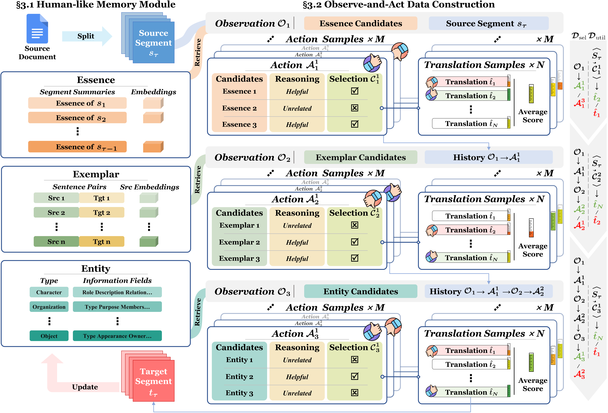

# LoongDocMT
This repository anonymously releases the codes and data for the paper Loong: A Human-Like Long Document Translation Agent with Observe-and-Act Adaptive Context Selection.

<div align="center">
    </img>
    <p class="image-caption">Loong: A Human-Like Long Document Translation Agent with Observe-and-Act Adaptive Context Selection</p>
</div>

## **🔗 Quick Links**

- **[About Loong](#about)**
- **[File Structure](#structure)**
- **[Installation](#installation)**
- **[Quick Start](#start)**
- **[Acknowledgements](#acknowledgements)**

## **🐉 About Loong**<a name="about"></a>
Loong is a human-like long document translation agent that employs reasoning-driven adaptive context selection optimized via reinforcement learning to resolve context limitation and noise issues in DocMT-LLMs, achieving significant gains in document translation quality and ultra-long document stability.

Loong is equipped with a "3E" memory model to store and retrieve candidate context information as the segment-wise translation proceeds:
- Enssence: Summaries of the processed segments
- Exemplar: Source-Target sentence pairs of all previous contents
- Entity: Structured records of all appeared entities (people, location, events, etc.)

Loong actively filter these candidate context items with a three-step observe-and-act trajectory.
In each step, Loong observe one kind of candidate items, determine whether it is helpful to translation through reasoning, and make its final information selection.
The filtered information subset is then employed to guide the translation process of the current segment to produce the final output.
We conduct parallel samping on each step, constructing preference data for DPO training to optimize Loong's context selection and utilization strategies, enhancing its overall performance.

<div align="center">
    </img>
    <p class="image-caption">The Framework of Loong</p>
</div>

## **📜 File Structure**<a name="structure"></a>
| Directory           | Contents                                                       |
| ------------------- | -------------------------------------------------------------- |
| `./data`            | Testing Data                                                   |
| `./scripts`         | Shared Python modules used by sampling and inference           |
| `./scripts/prompts` | Prompts for the agent                                          |
| `./sample`          | Training-data sampling launchers (`run_sample.sh`, `run_process.sh`, `process.py`) |
| `./train`           | LLaMA-Factory recipes and launcher for SFT + DPO fine-tuning   |
| `./inference`       | Inference launcher (`run_infer.sh`)                            |
| `./evaluate`        | Scripts for sCOMET, dCOMET and LLM-as-a-Judge                  |
| `./results`         | Testing outputs                                                |
| `./installation`    | Pip requirement files for the four conda environments          |
| `./LLaMA-Factory`   | Vendored copy of LLaMA-Factory installed editably by the training environment |
| `./COMET`           | Vendored copy of `doc-mt-metrics/COMET` installed editably by the dCOMET evaluation environment |


## **🛠️ Installation**<a name="installation"></a>

Loong relies on five separate conda environments — each isolates a stage of the
pipeline with conflicting dependency requirements (vLLM serving, the agent
client used for sampling/inference, LLaMA-Factory training, the sentence-level
COMET service, and the document-level COMET fork). The pip requirement files
for all five are provided under `./installation`, and the two environments
that depend on editable installs (`llama-factory` and `doccomet`) point at
vendored copies of the source repositories shipped with this release.

| Environment        | Purpose                                  | Requirements                                  |
| ------------------ | ---------------------------------------- | --------------------------------------------- |
| `vllm`             | vLLM model serving (deployed via OpenAI-compatible API) | `installation/requirements_vllm.txt`          |
| `loong`            | Trajectory sampling and inference (client side) | `installation/requirements_loong.txt`         |
| `llama-factory`    | SFT + LoRA-DPO fine-tuning               | `installation/requirements_llama-factory.txt` |
| `comet`            | sCOMET service deployment and scoring    | `installation/requirements_comet.txt`         |
| `doccomet`         | dCOMET (document-level COMET) evaluation | `installation/requirements_doccomet.txt`      |

Create each environment and install its dependencies:

```bash
# vLLM serving
conda create -n vllm python=3.11 -y
conda activate vllm
pip install -r installation/requirements_vllm.txt

# Sampling and inference (client)
conda create -n loong python=3.11 -y
conda activate loong
pip install -r installation/requirements_loong.txt

# Training (editable install of vendored LLaMA-Factory)
conda create -n llama-factory python=3.11 -y
conda activate llama-factory
pip install -r installation/requirements_llama-factory.txt

# sCOMET service + evaluation
conda create -n comet python=3.10 -y
conda activate comet
pip install -r installation/requirements_comet.txt

# dCOMET (editable install of vendored doc-mt-metrics/COMET)
conda create -n doccomet python=3.9 -y
conda activate doccomet
pip install -r installation/requirements_doccomet.txt
```


## **🚀 Quick Start**<a name="start"></a>

### **Training Data Sampling**

Training data is produced in two steps: first sample raw trajectories with
`run_sample.sh`, then convert them into LLaMA-Factory SFT/DPO datasets with
`run_process.sh`. A COMET scoring service must be deployed beforehand, since the
sampling pipeline calls it on every trajectory.

#### Step 0 — Deploy serving endpoints

Two services must be running before Step 1: a vLLM-served LLM (consumed by the
agent) and a COMET scorer (consumed for trajectory rewards). Their endpoints
must match the `urls` and `comet_apis` arrays used by `run_sample.sh`.

**vLLM serving** — run inside the `vllm` environment. Launch one process per
GPU you want to dedicate to serving; the endpoints are then passed to Step 1
through the `urls` array.

```bash
conda activate vllm
export LLM_MODEL=qwen   # must match --served-model-name below; read by the sampling/inference clients
CUDA_VISIBLE_DEVICES=0 nohup vllm serve Qwen3-8B \
    --host 0.0.0.0 \
    --port 8010 \
    --served-model-name "$LLM_MODEL" \
    --enable-prefix-caching \
    &> vllm.log &
```

**COMET serving** — `evaluate/deploy_comet.sh` launches a COMET model server in
the background (logs to `evaluate/deploy.log`). The endpoint exposed here must
match the `comet_apis` entries used by Step 1 (and the `comet_api` argument
used later by sCOMET evaluation).

Set the following inside the script before running:

- `model_path` — path to the COMET checkpoint to serve (e.g., `wmt22-comet-da/model.ckpt`).
- `port`       — listening port (default `8090`).

```bash
conda activate comet
bash evaluate/deploy_comet.sh
```

#### Step 1 — Raw trajectory sampling

- sample/run_sample.sh

Runs the observe-and-act sampling pipeline over the News Commentary v18.1 source files
to collect training data.
The input directory is expected to hold per-language sub-directories whose files are
named `${src_lang}.${doc_id}` and `${tgt_lang}.${doc_id}` (e.g., `en-zh/en.0`,
`en-zh/zh.0`). Outputs are written under `${out_dir}/${language}/${doc_id}`.

Set the following inside the script before running:

- `in_dir`         — parent directory containing per-language sub-dirs of News Commentary v18.1 raw training files.
- `out_dir`        — output directory for sampled trajectories (default `./results`).
- `languages`      — bash array of one or more translation directions, choices=[en-zh,en-de,en-fr,zh-en,de-en,fr-en].
- `urls`           — bash array of one or more deployed vLLM model APIs (e.g., `127.0.0.1:8000`); the worker pool size equals the number of URLs.
- `comet_apis`     — bash array of one or more deployed COMET model APIs (e.g., `127.0.0.1:8088`); workers are sharded across them.
- `tokenizer_path` — path to the LLM's tokenizer.
- `encoder_path`   — path to the `all-distilroberta-v1` checkpoint.
- `window_size`    — number of sentences per page within a document.

```bash
conda activate loong
LLM_MODEL=qwen bash sample/run_sample.sh   # value must match the --served-model-name registered on the vLLM endpoints
```

#### Step 2 — Dataset construction

- sample/run_process.sh

Constructs the SFT and DPO training data from the trajectories sampled in Step 1.

Set the following inside the script before running:

- `input_path`     — directory holding the per-chapter trajectories emitted by Step 1.
- `output_path`    — directory where the SFT/DPO JSON files and `dataset_info.json` are written.
- `tokenizer_path` — path to the LLM's tokenizer (used for length filtering).

```bash
bash sample/run_process.sh
```

### **Model Tuning**

- train/run_train.sh

Fine-tunes the base LLM in two stages: full-parameter SFT followed by LoRA-based DPO,
driven by LLaMA-Factory recipes.

Set the following inside the recipe files before running:

- `full_sft.yaml`
  - `model_name_or_path` — path to the pre-trained LLM checkpoint.
  - `deepspeed`          — path to `ds_z3_config.json`.
  - `dataset_dir`        — path to the SFT training data.
  - `template`           — `qwen` for Qwen2.5, `qwen3` for Qwen3, `llama3` for Llama3.1.
- `lora_dpo.yaml`
  - `model_name_or_path` — path to the SFT checkpoint.
  - `dataset_dir`        — path to the DPO training data.
  - `template`           — `qwen` for Qwen2.5, `qwen3` for Qwen3, `llama3` for Llama3.1.

```bash
conda activate llama-factory
bash train/run_train.sh
```

### **Inference**

Inference also depends on a vLLM-served LLM — point it at the fine-tuned
checkpoint produced by **Model Tuning**. Launch one process per GPU you want to
dedicate to serving, and pass the endpoint(s) to `run_infer.sh` via `address`.

```bash
conda activate vllm
export LLM_MODEL=qwen   # must match --served-model-name below; read by the inference client
CUDA_VISIBLE_DEVICES=0 nohup vllm serve <path/to/finetuned/checkpoint> \
    --host 0.0.0.0 \
    --port 8010 \
    --served-model-name "$LLM_MODEL" \
    --enable-prefix-caching \
    &> vllm.log &
```

- inference/run_infer.sh

Translates each document under the given source test file with the trained Loong agent
and writes hypotheses to the result directory.

Set the following inside the script before running:

- `address`   — deployed vLLM model API (e.g., `127.0.0.1:8000`).
- `language`  — translation direction, choices=[en-zh,en-de,en-fr,zh-en,de-en,fr-en].
- `src_file`  — source test file.

```bash
conda activate loong
LLM_MODEL=qwen bash inference/run_infer.sh   # value must match the --served-model-name registered on the vLLM endpoint
```

### **Evaluation**

We provide three evaluators under `./evaluate` to assess translation quality from complementary perspectives:
sentence-level COMET (sCOMET), document-level COMET (dCOMET), and an LLM-as-a-Judge protocol.

All three scripts share the same I/O convention:

- `data_dir`   — directory containing the source and reference files, named `${src_lang}.${doc_id}` and `${tgt_lang}.${doc_id}` (e.g., `en.0`, `zh.0`).
- `result_dir` — directory containing the hypothesis files produced by inference, named `${tgt_lang}.${doc_id}`.
- `language`   — translation direction, choices=[en-zh,en-de,en-fr,zh-en,de-en,fr-en].

#### sCOMET (sentence-level COMET)

- evaluate/eval_scomet.sh

Posts source–hypothesis–reference triples to a deployed COMET service and reports the
per-document average and the overall average. Output is written to `${result_dir}/comet.txt`.

```bash
bash eval_scomet.sh <data_dir> <result_dir> <language> [comet_api]
# comet_api defaults to 127.0.0.1:8090
```

#### dCOMET (document-level COMET)

- evaluate/eval_dcomet_total.sh

Concatenates all documents and uses `comet-score` with document-id boundaries to compute
document-level COMET in a single pass. Output is appended to `${result_dir}/doccomet_total.txt`.

The path to the `wmt22-comet-da` checkpoint can be provided either as a 4th positional
argument or through the `COMET_MODEL_PATH` environment variable.

```bash
conda activate doccomet
bash eval_dcomet_total.sh <data_dir> <result_dir> <language> <comet_model_path>
```

#### LLM-as-a-Judge

- evaluate/eval_llm.sh

Prompts a judge LLM to score each hypothesis document holistically on five dimensions —
General Quality, Cohesion, Coherence, Style Consistency, and Terminology Consistency
(0–100 each, plus a Meta average). Output is written to `${result_dir}/llm_${model}.txt`.

Set the judge model inside `eval_llm.sh`, and provide OpenAI-compatible credentials
either via environment variables or by editing the script:

```bash
# eval_llm.sh
model=      # judge model name (e.g., gpt-4.1)

# environment variables (read by default)
export OPENAI_API_KEY=...     # OpenAI-compatible API key
export OPENAI_BASE_URL=...    # OpenAI-compatible endpoint
```

```bash
bash eval_llm.sh <data_dir> <result_dir> <language>
```

## **🙏 Acknowledgements**<a name="acknowledgements"></a>

This codebase builds on the following open-source projects, and we thank their
authors and maintainers for releasing them:

- [vLLM](https://github.com/vllm-project/vllm) — high-throughput LLM serving used to host the agent's translation backbone.
- [LlamaFactory](https://github.com/hiyouga/LlamaFactory) — training framework used for SFT and LoRA-DPO fine-tuning.
- [uvicorn](https://github.com/Kludex/uvicorn) — ASGI server that hosts our COMET evaluation endpoint.
- [COMET](https://github.com/Unbabel/COMET) — sentence-level translation quality metric.
- [doc-mt-metrics](https://github.com/amazon-science/doc-mt-metrics) — document-level COMET extension used for dCOMET evaluation.

